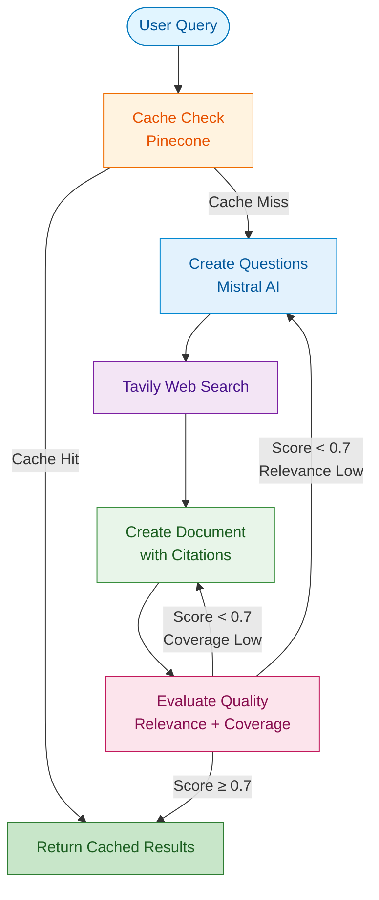

<div align="center">

# Research Agent 🤖

An intelligent AI-powered research assistant that automatically generates research questions, searches the web, creates comprehensive documents with proper citations, and self-evaluates its output quality. Built with **LangGraph** for robust workflow orchestration and **Streamlit** for an intuitive UI.

[](https://www.python.org/)
[](https://langchain-ai.github.io/langgraph/)
[](https://streamlit.io/)
[](https://mistral.ai/)
[](https://www.pinecone.io/)
[](https://tavily.com/)

</div>

## 🌟 Features

| Feature                  | Description                                                                      |
| ------------------------ | -------------------------------------------------------------------------------- |
| **Intelligent Research** | Automatically breaks down complex queries into focused research questions        |
| **Web Search**           | Searches the web using Tavily API for up-to-date information                     |
| **Citation Management**  | Properly cites all sources using numbered citations with full URLs               |
| **Semantic Caching**     | Caches research results to provide instant responses for repeat queries          |
| **Auto-Retry**           | Automatically rewrites questions or documents if quality score is low (<70%)     |
| **Real-time Streaming**  | Streams the research document as it's being written                              |
| **Quality Evaluation**   | Self-evaluates research relevance and coverage, provides improvement suggestions |
| **Dual Interface**       | Both terminal-based CLI and beautiful Streamlit web UI                           |

---

## 📑 Quick Navigation

- [🏗️ Architecture](#-architecture)
- [🚀 Quick Start](#-quick-start)
- [🎯 Usage](#-usage)
- [🔧 Configuration](#-configuration)
- [📊 Research Workflow](#-research-workflow)
- [🎨 UI Features](#-ui-features)
- [🗂️ Project Structure](#️-project-structure)
- [🔍 Technical Details](#-technical-details)
- [🐛 Troubleshooting](#-troubleshooting)

---

## 🏗️ Architecture



## 🚀 Quick Start

### Prerequisites

- Python 3.8+
- API keys for:
  - **Mistral AI** (for LLM)
  - **Google AI** (for embeddings)
  - **Pinecone** (for vector store)
  - **Tavily** (for web search)

### Installation

1. **Clone the repository**

   ```bash
   git clone <repository-url>
   cd Research-Agent
   ```

2. **Create and activate virtual environment**

   ```bash
   python -m venv venv

   # On Windows (Command Prompt)
   venv\Scripts\activate

   # On Windows (PowerShell)
   .\venv\Scripts\Activate.ps1

   # On Windows (Git Bash)
   source venv/Scripts/activate
   ```

3. **Install dependencies**

   ```bash
   pip install -r requirements.txt
   ```

4. **Set up environment variables**

   Create a `.env` file in the project root:

   ```env
   # Required API Keys
   MISTRAL_API_KEY=your_mistral_api_key_here
   GOOGLE_API_KEY=your_google_api_key_here
   PINECONE_API_KEY=your_pinecone_api_key_here
   TAVILY_API_KEY=your_tavily_api_key_here
   ```

   **Getting API Keys:**
   - **Mistral AI**: [Sign up at mistral.ai](https://console.mistral.ai/)
   - **Google AI**: [Get API key](https://makersuite.google.com/app/apikey)
   - **Pinecone**: [Create free account](https://www.pinecone.io/)
   - **Tavily**: [Get API key](https://tavily.com/)

## 🎯 Usage

### Option 1: Streamlit Web UI (Recommended)

Launch the beautiful web interface:

```bash
streamlit run Frontend.py
```

The UI features:

- Clean, modern design with real-time streaming
- Live status updates for each research phase
- Downloadable research documents
- Source citations with clickable links
- Quality evaluation scores with visual indicators
- Sidebar with helpful information

### Option 2: Terminal/CLI

Run research directly from the terminal:

```bash
python main.py
```

You'll be prompted to enter a research query, and the document will stream directly to your terminal.

## 🔧 Configuration

### Models & Services (config.py)

The system uses the following configuration (can be customized in `config.py`):

```python
# LLM Model
model = ChatMistralAI(model_name="mistral-large-2512")

# Embeddings
embeddings = GoogleGenerativeAIEmbeddings(model="gemini-embedding-001")

# Vector Store for Semantic Cache
VECTORSTORE = PineconeVectorStore(
    index_name="research-agent-semantic-cache",
    embedding=embeddings,
)

# Cache Similarity Threshold
CACHE_DISTANCE = 0.7
```

## 📊 Research Workflow

The research agent follows this intelligent workflow:

1. **Check Cache** → Check if similar query exists in semantic cache
2. **Generate Questions** → Create 4-6 focused research questions based on query
3. **Web Research** → Search web using Tavily API for each question
4. **Create Document** → Write comprehensive document with proper citations
5. **Evaluate Quality** → Score relevance and coverage (0-1 scale)
6. **Auto-Retry** → If score < 0.7, rewrite questions or document (up to 3 attempts)
7. **Return Results** → Provide final document with evaluation and sources

## 📝 Example Usage

### Query: "Best specialty coffee shops in India"

**What happens behind the scenes:**

1. **Cache Check**: Looks for similar queries in cache
2. **Question Generation**: Creates questions like:
   - "What are the top-rated specialty coffee shops in major Indian cities?"
   - "Which Indian coffee shops are known for sourcing high-quality beans?"
   - "What unique brewing methods do Indian specialty coffee shops offer?"
3. **Web Search**: Tavily searches for each question
4. **Document Creation**: Writes structured document with sections for each question
5. **Citation Management**: Every factual sentence ends with citation `[1](url)`
6. **Quality Evaluation**: Scores relevance (how well it answers "best shops") and coverage
7. **Auto-Retry**: If needed, rewrites questions with better focus or regenerates document

## 🎨 UI Features

### Streamlit Interface

The Streamlit UI (`Frontend.py`) provides:

- **Real-time Streaming**: Watch the document being written live
- **Status Updates**: Clear indicators for each phase of research
- **Source Display**: Clickable links to all sources used
- **Quality Metrics**: Visual score with progress bar and color coding
- **Download Button**: Save research as Markdown file
- **Sidebar Info**: Helpful tips and feature explanations
- **Clear Results**: Reset and run new research

### Quality Score Visualization

- 🟢 **80-100%**: Excellent quality
- 🟡 **50-79%**: Good quality
- 🔴 **0-49%**: Needs improvement (triggers retry)

## 🗂️ Project Structure

```
Research-Agent/
├── main.py                 # CLI entry point
├── Frontend.py            # Streamlit UI
├── graph.py               # LangGraph workflow
├── config.py              # Model & API configuration
├── States.py              # State schemas
├── nodes.py               # Workflow nodes
├── cache.py               # Semantic cache logic
├── Prompts.py             # Prompt templates
├── requirements.txt       # Python dependencies
└── .env                   # API keys (create this)
```

## 🔍 Technical Details

### State Management (States.py)

The agent uses a centralized state object (`AgnentState`) that tracks:

- User query and research questions
- Research chunks from web search
- Generated document
- Quality scores and improvement suggestions
- Retry counts for questions and documents

### Prompt Templates (Prompts.py)

Three specialized prompts:

1. **Question Generation**: Creates focused, researchable questions
2. **Document Creation**: Writes factual documents with strict citation rules
3. **Evaluation**: Scores relevance and coverage, suggests improvements

### LangGraph Workflow (graph.py)

Directed graph with conditional routing:

- **Linear flow**: Cache → Questions → Research → Document → Evaluation
- **Conditional loops**: Evaluation can route back to Questions or Document
- **End condition**: Reaches END when quality is sufficient or max retries hit

## 🐛 Troubleshooting

### Common Issues

**Issue**: "API key not found" error

- **Solution**: Ensure `.env` file exists with all required API keys

**Issue**: "Module not found" errors

- **Solution**: Make sure virtual environment is activated and dependencies installed

**Issue**: Research quality consistently low

- **Solution**: Check Tavily API key and internet connectivity

**Issue**: Cache not working

- **Solution**: Verify Pinecone index exists and API key is correct

## 🚀 Performance Tips

- **Use cache**: Similar queries will be much faster on repeat
- **Clear queries**: More specific queries yield better research quality
- **Monitor scores**: Check evaluation scores to understand quality
- **API limits**: Be mindful of API rate limits for free tiers

## 📚 Example Research Topics

The agent excels at:

- "Best [service/product] in [location]"
- "How to [accomplish task] step by step"
- "Comparison of [product A] vs [product B]"
- "History and evolution of [topic]"
- "Key trends in [industry] for [year]"

---

## 📞 Support

- **Email**: [work.raj.38@gmail.com](mailto:work.raj.38@gmail.com)
- **Issues**: [GitHub Issues](https://github.com/RajTejani61/Research-Agent/issues)

---

<div align="center">

[⬆️ Back to Top](#research-agent)

</div>
